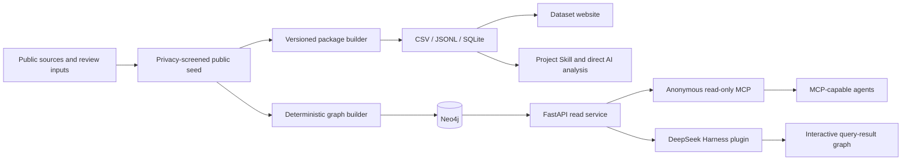

# Global LCA Asset

**English** | [简体中文](README.zh-CN.md)

Global LCA Asset is a versioned public-evidence dataset and access system for life cycle assessment resources worldwide. It brings databases, datasets, software, schemas, formats, nomenclatures, organizations, releases, distributions, and mapping projects into one reviewed structure.

The dataset is the shared foundation. The website, downloadable files, knowledge graph, MCP, client plugin, and project Skill are complementary ways to explore and use the same evidence—not separate inventories.

## Current dataset

Release `2026-08-25.7` has an evidence cut-off of 25 August 2026.

| Published object | Count |
|---|---:|
| Asset families | 214 |
| Core database families | 80 |
| Extended data-bearing assets | 88 |
| Public evidence records | 252 |
| Releases or milestones | 310 |
| Distributions | 170 |
| Mapping artifacts | 25 |
| Relationship assertions | 310 |

The imported graph snapshot contains 1,903 nodes and 2,721 relationships. All counts are reproducible lower bounds under the published inclusion rules and evidence cut-off; they are not claims of a final worldwide total.

## Project architecture



| Component | Primary purpose | Main location | Neo4j required? |
|---|---|---|---:|
| Dataset package | Reproducible research data for spreadsheets, AI, and exact queries | `data/package/current/` | No |
| Dataset website | Public exploration, comparison, sources, and downloads | `packages/global-lca-asset-web/` | No |
| Knowledge graph | Relationship, neighborhood, path, evidence, and timeline queries | `src/global_lca_asset/` | Yes |
| REST API and MCP | Safe machine access to the graph | `/api/*` and `/mcp` | Yes |
| DeepSeek Harness plugin | Natural-language graph tools and interactive result cards | `packages/dsh-lca-plugin/` | Through the API |
| Project Skill | Consistent local analysis of CSV, JSONL, and SQLite | `skills/global-lca-asset-review/` | No |

## 1. Public dataset and data package

The privacy-screened public seed at `data/seed/inventory-v2.public.json` is the canonical input. A deterministic build creates the versioned package in `data/package/current/`, including:

- CSV for spreadsheet review and exchange;
- JSONL for direct AI-assisted analysis;
- SQLite for precise relational queries;
- the manifest, validation report, summary, controlled vocabularies, and analysis rules;
- alignment tables for schema/profile synonyms and mapping endpoints.

The package distinguishes Asset, Release, Distribution, MappingArtifact, Assertion, Evidence, Organization, and their relationships. Original labels are preserved alongside aligned values where normalization is applied.

Questionnaire contacts, personal name/email mappings, and internal reviewer notes are excluded from the public seed and generated package.

## 2. Dataset website

The standalone Global LCA Asset website publishes the dataset for researchers. It provides:

- dataset-level counts and asset-category coverage;
- focused views for database scope, access conditions, formats and software, providers and sectors, and mappings;
- cross-asset search, source links, comparison, and data downloads;
- an on-demand relationship view that loads a lightweight asset index and selected one-hop neighborhoods.

The website reads generated static files and does not require Neo4j. It can therefore be built and deployed as an independent Vercel project. The on-demand website graph is a public exploration view; it is separate from the server-side Neo4j query service.

## 3. Knowledge graph

The graph builder converts the public seed into stable graph objects such as Asset, Release, Distribution, MappingArtifact, Assertion, Evidence, and ExternalReference. Stable UIDs and idempotent `MERGE` operations allow the same release to be imported repeatedly without duplication.

Neo4j supports relationship expansion, multi-hop paths, evidence tracing, comparisons, and timelines. A documented compatibility or mapping relationship must still be interpreted with its direction, version pair, test status, evidence, and known conversion losses; a relationship does not automatically imply a lossless conversion.

Two visual graph experiences serve different purposes:

- the dataset website progressively loads selected public one-hop neighborhoods without Neo4j;
- the DeepSeek Harness companion displays the evidence subgraph returned by an individual query, with Graph, Data, and Evidence views.

## 4. REST API and public MCP

FastAPI provides the controlled read/query layer over Neo4j. It supports asset search and detail, neighborhoods, shortest paths, comparisons, timelines, evidence, statistics, schema inspection, and validated structured query plans.

The public `/mcp` endpoint uses stateless Streamable HTTP and requires no token. It exposes 10 size-limited public read tools for MCP-capable clients such as Codex, Claude Code, OpenClaw, Tencent WorkBuddy, and TRAE. It does not expose writes, imports, database administration, or arbitrary Cypher.

An expert read-only Cypher endpoint is available but disabled by default. When enabled, it rejects writes, procedures, and multiple statements, runs `EXPLAIN` first, and should use a Neo4j reader identity in production.

See the [query guide](docs/query-guide.md) for tool selection, REST examples, and research caveats.

## 5. DeepSeek Harness plugin

The out-of-tree DeepSeek Harness plugin is a reference client for natural-language graph analysis. It translates model tool calls into requests to the Global LCA Asset API without exposing Neo4j credentials to the model.

The installable bundle combines:

- `packages/dsh-lca-plugin/` for tools, domain guidance, and API calls;
- `packages/dsh-lca-graph-ui/` for interactive Graph, Data, and Evidence result views.

DeepSeek Harness remains an independent upstream project; this repository does not modify, copy, or fork it. Other AI clients can use the public MCP directly and do not need this plugin.

## 6. Project Skill

The repository includes the `global-lca-asset-review` Skill for querying and interpreting the versioned evidence package directly. It is intended for questions about databases, access conditions, formats, schemas, software compatibility, organizations, sectors, releases, mappings, and evidence quality.

The Skill uses the same CSV, JSONL, and SQLite release as the website. It can answer ad hoc questions or generate new tables and HTML views without requiring a running graph database.

## Choosing an access route

| Need | Recommended route |
|---|---|
| Browse and filter the published dataset | Dataset website |
| Download or cite a versioned release | CSV, JSONL, SQLite, and manifest |
| Ask an AI to analyze the complete small dataset directly | Project Skill with JSONL or SQLite |
| Explore multi-hop relationships or shortest paths | Public MCP or REST API |
| Use natural-language graph tools in DeepSeek Harness | DSH plugin bundle |
| Reproduce or extend the graph service | Neo4j, FastAPI, and the graph builder |

## Run locally

### Dataset website only

```bash
pnpm install
pnpm data:build
pnpm web:dev
```

Open <http://127.0.0.1:5173/>.

### Complete graph, API, and MCP stack

Docker Desktop is required:

```bash
docker compose up -d --build
```

After startup:

- API and interactive documentation: <http://127.0.0.1:8000/docs>
- Anonymous read-only MCP: <http://127.0.0.1:8000/mcp>
- Neo4j Browser: <http://127.0.0.1:7474>
- Health check: <http://127.0.0.1:8000/health>

`seed` is a one-time import container; exit code 0 is expected.

### DeepSeek Harness reference client

```bash
pnpm build
GLOBAL_LCA_API_URL=http://127.0.0.1:8000 pnpm dsh:web
```

To build an installable bundle:

```bash
pnpm pack:plugin
dsh plugin --profile global-lca add /absolute/path/to/global-lca-dsh-lca-plugin-0.2.0.tgz
```

## Deployment

The two public deployment targets are independent:

- the static dataset website can be deployed directly from `packages/global-lca-asset-web/` as a standalone Vercel project;
- the repository-root `app.py` deploys the stateless FastAPI/MCP layer to Vercel, while Neo4j runs in AuraDB or another securely accessible managed environment.

Configuration, access boundaries, and production checks are documented in [Vercel deployment](docs/vercel-deployment.md).

## Verification

```bash
uv sync --extra dev
uv run pytest
uv run ruff check src tests
pnpm install
pnpm data:build
pnpm data:verify
pnpm typecheck
pnpm test
pnpm build
pnpm smoke
```

## Repository map

```text
data/seed/                        Canonical privacy-screened public seed
data/curated/                     Review context, alignment, and data definitions
data/package/current/             Versioned CSV, JSONL, SQLite, and validation files
packages/global-lca-asset-web/    Standalone dataset publication website
src/global_lca_asset/             Graph builder, Neo4j repository, API, MCP, and CLI
packages/dsh-lca-plugin/          DeepSeek Harness query plugin
packages/dsh-lca-graph-ui/        Interactive graph companion for query results
skills/global-lca-asset-review/   Project query, analysis, update, and visualization Skill
graph/queries/                    Reference queries for the six review questions
config/                           Local read-only client configuration
tests/                            Data, API, and secure-query tests
docs/                             Architecture, data model, use, and maintenance guides
```

## Project ownership and feedback

- Project owner: UNEP Global LCA Platform Working Group 2
- Jianchuan Qi, Tsinghua University
- Natasha Das, AECOM
- António Martins
- Comment and feedback: [submit corrections, missing assets, source updates, comments, or suggestions](https://uzmhiopsjv.feishu.cn/share/base/form/shrcnLwAU43hwAwb5bsDNMoaohc)
- Git project: [github.com/jianchuanqi/global-lca-asset](https://github.com/jianchuanqi/global-lca-asset)

## Documentation

- [System architecture](docs/architecture.md)
- [Graph data model](docs/graph-model.md)
- [Query guide](docs/query-guide.md)
- [DeepSeek Harness usage](docs/deepseek-harness.md)
- [Graph-results interface design](docs/graph-visualization.md)
- [Dataset website](packages/global-lca-asset-web/README.md)
- [Vercel deployment](docs/vercel-deployment.md)
- [Development and acceptance status](docs/development-plan.md)
