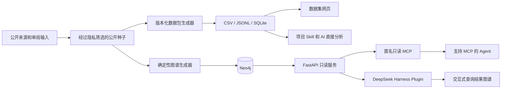

# Global LCA Asset

**简体中文** | [English](README.md)

Global LCA Asset 是一个面向全球生命周期评价资源的版本化公共证据数据集及其访问系统。它把数据库、数据集、软件、schema、格式、名录、机构、版本、分发包和 mapping 项目组织在统一的审阅结构中。

数据集是整个项目的共同基础。网页、可下载文件、知识图谱、MCP、客户端 Plugin 和项目 Skill，是使用同一套证据的不同方式，而不是彼此独立的多份清单。

## 当前数据集

当前版本为 `2026-08-25.7`，证据截止日期为 2026 年 8 月 25 日。

| 发布对象 | 数量 |
|---|---:|
| 资产家族 | 214 |
| 核心数据库家族 | 80 |
| 扩展数据承载资产 | 88 |
| 公开证据记录 | 252 |
| 版本或里程碑 | 310 |
| 分发包 | 170 |
| Mapping artifact | 25 |
| 关系断言 | 310 |

导入后的图谱快照包含 1,903 个节点和 2,721 条关系。所有数量都是在已发布纳入规则和证据截止日期下可复现的下限，并不表示已经得到最终的全球总数。

## 项目架构



| 组成部分 | 主要用途 | 主要位置 | 是否需要 Neo4j |
|---|---|---|---:|
| 数据包 | 供表格、AI 和精确查询使用的可复现研究数据 | `data/package/current/` | 否 |
| 数据集网页 | 公开检索、比较、来源查看和下载 | `packages/global-lca-asset-web/` | 否 |
| 知识图谱 | 关系、邻域、路径、证据和时间线查询 | `src/global_lca_asset/` | 是 |
| REST API 与 MCP | 安全的图谱机器访问接口 | `/api/*` 和 `/mcp` | 是 |
| DeepSeek Harness Plugin | 自然语言图谱工具和交互式结果卡 | `packages/dsh-lca-plugin/` | 通过 API 使用 |
| 项目 Skill | 对 CSV、JSONL 和 SQLite 进行统一口径的本地分析 | `skills/global-lca-asset-review/` | 否 |

## 1. 公共数据集与数据包

`data/seed/inventory-v2.public.json` 是经过隐私筛选的权威公开输入。确定性构建流程在 `data/package/current/` 生成版本化数据包，包括：

- 适合表格审阅和交换的 CSV；
- 适合 AI 直接分析的 JSONL；
- 适合精确关系查询的 SQLite；
- manifest、校验报告、汇总、受控词表和分析规则；
- schema/profile 同义词以及 mapping 端点的对齐表。

数据包区分 Asset、Release、Distribution、MappingArtifact、Assertion、Evidence、Organization 及其关系。凡进行了名称对齐，均在对齐值之外保留来源中的原始名称。

问卷联系人、个人姓名与邮箱映射、内部审阅备注不进入公开种子和生成的数据包。

## 2. 数据集网页

独立的 Global LCA Asset 网页面向研究人员发布数据集，提供：

- 数据集数量和资产类别覆盖统计；
- 数据库范围、获取方式、格式与软件、开发者与行业、mapping 等主题视图；
- 跨资产检索、原始来源、资产比较和数据下载；
- 按需关系视图：先载入轻量资产索引，再载入用户选定资产的一跳邻域。

网页读取生成的静态文件，不依赖 Neo4j，因此可以作为独立的 Vercel 项目构建和部署。网页中的按需关系图用于公开探索，与服务器端的 Neo4j 查询服务相互独立。

## 3. 知识图谱

图谱生成器把公开种子转换为 Asset、Release、Distribution、MappingArtifact、Assertion、Evidence 和 ExternalReference 等稳定对象。所有对象使用稳定 UID，并通过幂等 `MERGE` 导入；同一版本重复导入不会产生重复节点。

Neo4j 支持关系展开、多跳路径、证据追踪、比较和时间线查询。解释兼容或 mapping 关系时，仍必须同时检查方向、版本组合、测试状态、证据和已知转换损失；存在关系并不自动意味着可以无损转换。

项目提供两种用途不同的图形化关系视图：

- 数据集网页无需 Neo4j，按需加载选定资产的公开一跳邻域；
- DeepSeek Harness 图谱界面显示某次查询实际返回的证据子图，并提供 Graph、Data 和 Evidence 三种视图。

## 4. REST API 与公共 MCP

FastAPI 是 Neo4j 之上的受控读取与查询层，支持资产搜索和详情、邻域、最短路径、比较、时间线、证据、统计、schema 查看和经过校验的结构化查询计划。

公共 `/mcp` 使用无状态 Streamable HTTP，不需要 token。它向 Codex、Claude Code、OpenClaw、腾讯 WorkBuddy、TRAE 等支持 MCP 的客户端提供 10 个有规模限制的公共只读工具，不开放写入、导入、数据库管理或任意 Cypher。

专家只读 Cypher 默认关闭。显式开启后仍会拒绝写入、procedure 和多语句，先运行 `EXPLAIN`；正式环境还应使用 Neo4j reader 身份。

工具选择、REST 示例和研究解释注意事项见[《查询指南》](docs/query-guide.md)。

## 5. DeepSeek Harness Plugin

仓外 DeepSeek Harness Plugin 是自然语言图谱分析的示范客户端。它把模型的工具调用转换为 Global LCA Asset API 请求，不会向模型暴露 Neo4j 凭据。

可安装 bundle 由两个部分组成：

- `packages/dsh-lca-plugin/`：模型工具、领域说明和 API 调用；
- `packages/dsh-lca-graph-ui/`：交互式 Graph、Data 和 Evidence 结果视图。

DeepSeek Harness 仍是独立的上游项目；本仓库不修改、不复制也不 fork 它。其他 AI 客户端可以直接使用公共 MCP，不需要安装该 Plugin。

## 6. 项目 Skill

仓库内置 `global-lca-asset-review` Skill，用于直接查询和解释版本化证据数据包。它适合回答数据库、获取条件、格式、schema、软件兼容性、机构、行业、版本、mapping 和证据质量等问题。修改请求只授权 scoped local edits、数据包重建、验证和 PR-ready contribution；commit、push 和创建 Pull Request 是独立操作，只有用户另行明确要求时 Skill 才会执行。

Skill 与网页使用同一份 CSV、JSONL 和 SQLite 数据，可以回答临时问题或即时生成新的表格和 HTML 视图，不要求运行图数据库。

先 clone 仓库，再为 Codex、Claude Code 或两者安装仓库内的 Skill。默认使用链接模式，因此两个 Agent 修改的都是同一个 Git 工作树：

```bash
git clone https://github.com/jianchuanqi/global-lca-asset.git
cd global-lca-asset
python3 scripts/install-skill.py --target all
```

只安装一个客户端时使用 `--target codex` 或 `--target claude`。不支持目录链接的系统可使用 `--mode copy`。安装器不会覆盖已有的同名 Skill。Fork、review、验证和 Pull Request 工作流见[《Skill 安装与贡献》](docs/skill-installation-and-contribution.md)；完整操作示例见[《更新已有资产 review 数据》](docs/data-update-example.zh-CN.md)。

## 如何选择使用方式

| 需求 | 推荐入口 |
|---|---|
| 浏览和筛选已发布数据集 | 数据集网页 |
| 下载或引用一个固定版本 | CSV、JSONL、SQLite 和 manifest |
| 让 AI 直接分析完整的小型数据集 | 项目 Skill 配合 JSONL 或 SQLite |
| Review、修正或新增公开证据记录 | 在 clone 的 Git 仓库中使用项目 Skill |
| 验证贡献并创建 Pull Request | 项目 Skill 配合 Git 和 GitHub CLI |
| 探索多跳关系或最短路径 | 公共 MCP 或 REST API |
| 在 DeepSeek Harness 中使用自然语言图谱工具 | DSH Plugin bundle |
| 复现或扩展图谱服务 | Neo4j、FastAPI 和图谱生成器 |

## 本地运行

### 只运行数据集网页

```bash
pnpm install
pnpm data:build
pnpm web:dev
```

浏览器打开 <http://127.0.0.1:5173/>。

### 运行完整图谱、API 和 MCP

需要 Docker Desktop：

```bash
docker compose up -d --build
```

启动后：

- API 和交互式文档：<http://127.0.0.1:8000/docs>
- 匿名只读 MCP：<http://127.0.0.1:8000/mcp>
- Neo4j Browser：<http://127.0.0.1:7474>
- 健康检查：<http://127.0.0.1:8000/health>

`seed` 是一次性导入容器；正常结束码为 0。

### DeepSeek Harness 示范客户端

```bash
pnpm build
GLOBAL_LCA_API_URL=http://127.0.0.1:8000 pnpm dsh:web
```

生成可安装 bundle：

```bash
pnpm pack:plugin
dsh plugin --profile global-lca add /absolute/path/to/global-lca-dsh-lca-plugin-0.2.0.tgz
```

## 部署

两个公共部署目标彼此独立：

- 静态数据集网页可以从 `packages/global-lca-asset-web/` 直接部署为独立的 Vercel 项目；
- 仓库根目录的 `app.py` 把无状态 FastAPI/MCP 层部署到 Vercel，Neo4j 则运行在 AuraDB 或其他可安全访问的托管环境中。

配置、访问边界和正式环境检查见[《Vercel 部署》](docs/vercel-deployment.md)。

## 验证

离线 contribution gate 不需要 Neo4j 或 Docker：

```bash
uv sync --extra dev
uv run pytest
uv run ruff check src tests
pnpm install
pnpm data:build
pnpm data:verify
pnpm typecheck
pnpm test
pnpm build
```

`pnpm smoke` 是 Neo4j → API → 客户端 Plugin 的在线集成 gate。应先启动完整 stack；`seed` 应以状态码 0 结束，`neo4j` 和 `api` 应进入 healthy：

```bash
docker compose up -d --build
docker compose ps -a
pnpm smoke
```

smoke 会先快速检查 `/health`；API 不可用时会直接给出启动和日志命令。测试受保护的远程部署时，应先设置 `GLOBAL_LCA_API_URL` 和 `GLOBAL_LCA_API_TOKEN`。

## 项目目录

```text
data/seed/                        经过隐私筛选的权威公开种子
data/curated/                     审阅口径、对齐规则和数据定义
data/package/current/             版本化 CSV、JSONL、SQLite 和校验文件
packages/global-lca-asset-web/    独立的数据集发布网页
src/global_lca_asset/             图谱生成器、Neo4j repository、API、MCP 和 CLI
packages/dsh-lca-plugin/          DeepSeek Harness 查询 Plugin
packages/dsh-lca-graph-ui/        查询结果的交互式图谱界面
skills/global-lca-asset-review/   项目查询、分析、更新和可视化 Skill
graph/queries/                    六个 review 问题的参考查询
config/                           本地只读客户端配置
tests/                            数据、API 和安全查询测试
docs/                             架构、数据模型、使用和维护说明
```

## 项目归属与反馈

- Project owner: UNEP Global LCA Platform Working Group 2
- Jianchuan Qi, Tsinghua University
- Natasha Das, AECOM
- António Martins, Portuguese Catholic University
- Comment & feedback: [提交错误更正、遗漏资产、来源更新、评论和建议](https://uzmhiopsjv.feishu.cn/share/base/form/shrcnLwAU43hwAwb5bsDNMoaohc)
- Git project: [github.com/jianchuanqi/global-lca-asset](https://github.com/jianchuanqi/global-lca-asset)

## 文档

- [系统架构](docs/architecture.md)
- [图谱数据模型](docs/graph-model.md)
- [查询指南](docs/query-guide.md)
- [DeepSeek Harness 使用](docs/deepseek-harness.md)
- [图谱结果界面设计](docs/graph-visualization.md)
- [数据集网页](packages/global-lca-asset-web/README.md)
- [Vercel 部署](docs/vercel-deployment.md)
- [开发与验收状态](docs/development-plan.md)
