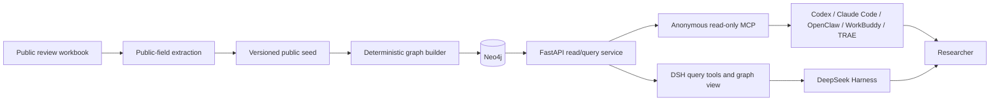
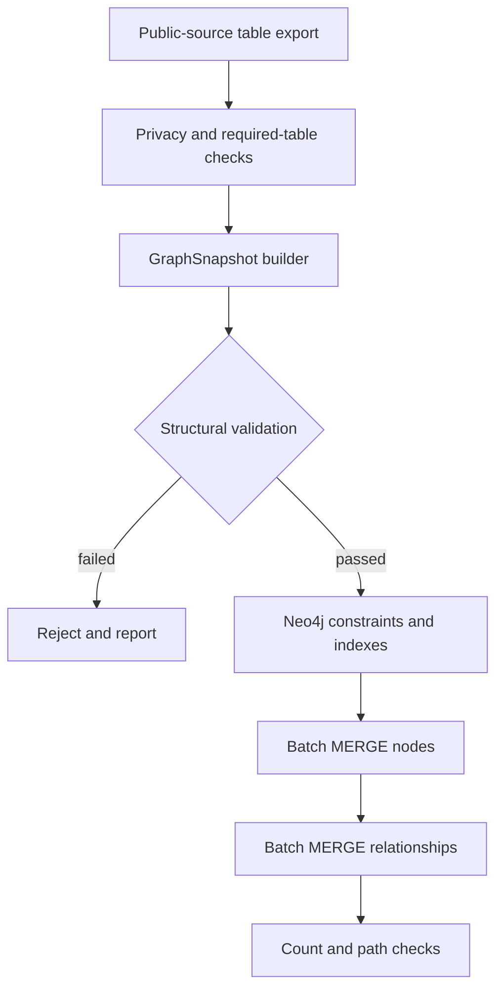
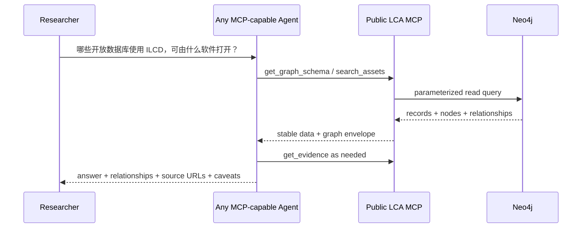

# 系统架构

## 1. 当前实现

本仓库是知识图谱、公共数据和查询服务的权威项目。官方参考 Skill 将作为独立 Git 项目维护；用户也可以完全不用官方 Skill，直接通过公共 MCP 查询图谱。DeepSeek Harness 是独立上游项目，本仓库不修改、不复制也不 fork DSH。

各层的责任明确分开：

- `data/seed/inventory-v2.public.json` 保存经过隐私筛选的公共来源表，不包含联系人和内部映射。
- Python 图谱构建器把宽表转换为 Asset、Release、Distribution、MappingArtifact、Assertion、Evidence 等对象。
- Neo4j 是关系查询的事实库，所有节点和关系使用稳定 UID，导入使用幂等 `MERGE`。
- FastAPI 统一提供筛选、路径、时间线、证据、结构化查询计划和可选专家 Cypher。
- MCP 复用同一个只读 repository，只暴露有输入上限的公共工具；不提供任意 Cypher。
- DSH 插件把 API 暴露为模型工具，并向模型注入 LCA 口径、证据和不确定性规则。
- 图谱结果界面读取同一次工具调用保存的结构化结果，呈现关系图、数据表和证据；浏览器不直接连接 Neo4j。
- 用户直接在 DSH 的对话界面提问；不再维护一套传统的业务前端。

## 2. Git 项目边界

本仓库保留图谱模型、数据审核、导入、Neo4j、MCP、REST API、公共快照和接口契约。可选的官方 Skill、不同 Agent 的安装说明和跨平台提示词放入独立的 `global-lca-asset-skill` 项目。两者通过 MCP contract、ontology version 和 data snapshot 版本衔接。现有 DSH 适配器暂时留在本仓库，稳定后再决定是否迁移。

## 3. 数据路径

当前公开基线转换结果为：

| 对象 | 数量 |
|---|---:|
| Asset family | 199 |
| Evidence | 205 |
| Release / milestone | 290 |
| Distribution | 128 |
| MappingArtifact | 18 |
| Assertion | 233 |
| 全部节点 | 1,663 |
| 全部关系 | 2,282 |

`Assertion` 数量和源表 233 条关系逐条对账。源或目标不是主资产的关系会连接到 `ExternalReference`，不会因为尚未完成实体归并而丢失。

## 4. 自然语言查询

自然语言理解由用户选择的 Agent 完成，但模型不能直接访问数据库。通用过程如下：

MCP 的普通查询全部使用服务器预定义、参数化的 Cypher。REST API 仍保留 `GraphQueryPlan`：它只能使用公开 schema 中允许的 label、relationship、property 和 operator，用户值不会插入查询字符串。这个设计使中文、英文和混合语言都可以使用同一图谱查询接口。

## 5. 专家 Cypher

专家入口和自然语言入口相互独立：

- 默认完全关闭。
- 开启后只接受一个以 `MATCH`、`OPTIONAL MATCH`、`WITH`、`UNWIND` 或 `RETURN` 开始的语句。
- 拒绝写入、管理、procedure、`LOAD CSV` 和分号多语句。
- 先 `EXPLAIN`，再通过 driver 的 read access 执行，并截断返回记录。
- 正式部署还必须给 API 使用 Neo4j reader 身份，应用层检查不是唯一安全边界。

## 6. DSH 插件

对外仍是一个可安装的 Cordis/DSH bundle，内部包含两个相互配套的包：

- `packages/dsh-lca-plugin`：负责模型工具、领域说明和 API 调用。
- `packages/dsh-lca-graph-ui`：负责把带有关系子图的工具结果呈现为交互式图卡。

查询工具包括：

- `lca_graph_statistics`
- `lca_schema`
- `lca_search_assets`
- `lca_get_asset`
- `lca_find_relationships`
- `lca_find_path`
- `lca_compare_assets`
- `lca_get_timeline`
- `lca_get_evidence`
- `lca_query_graph`
- `lca_run_readonly_cypher`，仅在显式开启时注册

构建时，图谱伴随界面被编译进查询 bundle 的 browser client；使用者只安装一个包。查询完成时，工具把 `nodes`、`relationships`、`records` 作为稳定的展示元数据随会话保存。图谱伴随界面只接管五类带关系子图的结果；其他工具仍使用 DSH 原有显示。因而旧会话可以重放图谱，模型文字回答与图形也来自同一份结果。

## 7. 公共 MCP

公共 `/mcp` 使用 Streamable HTTP、JSON 响应和无状态模式。所有结果统一包含 `schema_version`、`scope`、`data`、`graph` 和 `warnings`。工具输入限制搜索数量、图谱深度、路径长度和返回规模；Neo4j 查询还带有服务器端超时。

公共工具包括搜索、详情、关系扩展、最短路径、比较、时间线、证据、统计、schema 和服务状态。MCP 不注册 Cypher、写入、导入或数据库管理工具。

## 8. API

| Endpoint | 作用 |
|---|---|
| `GET /health` | 数据库连通性 |
| `GET /api/schema` | AI 查询允许的图谱词汇和计划示例 |
| `GET /api/statistics` | 节点、关系和证据截止信息 |
| `GET /api/assets` | 文本和字段筛选 |
| `GET /api/assets/{id}` | 资产及一跳关系 |
| `GET /api/assets/{id}/timeline` | 版本时间线 |
| `GET /api/evidence/{id}` | 证据、URL 和支持的资产 |
| `GET /api/graph/neighborhood` | 限深邻域子图 |
| `GET /api/graph/path` | 两个节点的最短关系路径 |
| `POST /api/compare` | 资产字段比较 |
| `POST /api/query/plan` | 安全结构化查询 |
| `POST /api/query/cypher` | 可选专家只读 Cypher |

所有图查询统一返回 `nodes`、`relationships` 和 `records`，DSH 可以据此解释具体关系，而不是只读取一段预先生成的文字。

## 9. 部署

本地使用 Docker Compose：Neo4j、API/MCP 和一次性 seed importer。Vercel 只运行无状态 FastAPI/MCP，Neo4j 使用外部托管实例和专用 reader 身份。正式环境还需要 TLS、备份、日志和 Vercel Firewall 限流；具体变量和检查见 `docs/vercel-deployment.md`。当前系统不需要消息队列、独立向量数据库或另一个传统前端。

## 10. 已知边界

- 199 是本次公开证据 review 的资产数，不是经过证明的全球终值。
- 公开来源不能确认的版本、许可、schema 修订或软件测试仍保留原始“不确认”状态。
- `MAPPED_TO` 可以表示 alignment 或 mapping 声明，必须结合 MappingArtifact、Assertion、`claimed_tested` 和 `known_loss_exception` 判断，不能自动理解为无损转换。
- 图谱卡展示的是当前查询返回的子图，不试图一次加载 1,663 个节点；超过 500 个节点或 1,500 条关系时会明确标记受限视图。
