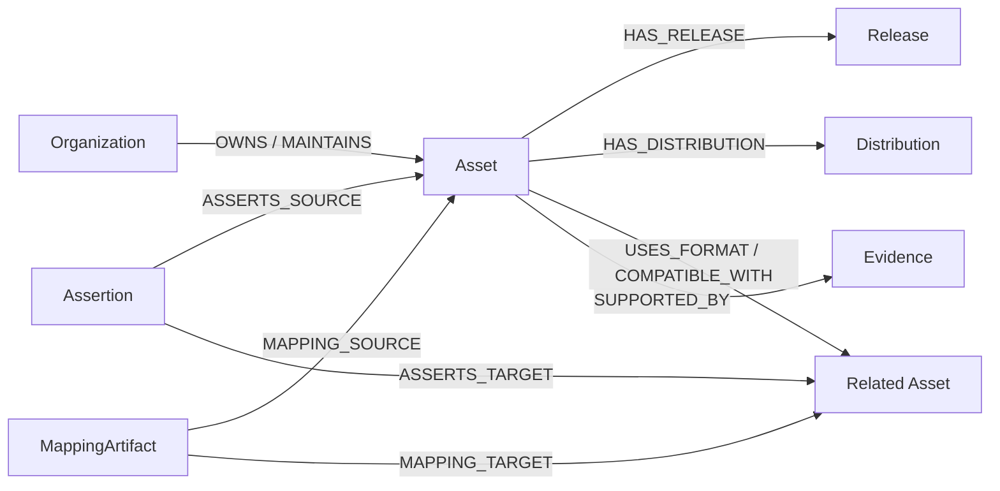

# 图谱数据模型

## 1. 核心原则

图谱不把整张 Excel 宽表简单复制成一个大节点。它区分长期存在的资产家族、具体版本、分发方式、mapping、关系声明和证据：



每个节点都有稳定 `uid`、`name`、基础标签 `Entity` 和一个或多个领域标签。每条关系也有稳定 `uid`，因此重复导入不会增殖。

## 2. 节点

### 主资产

所有 214 个主资产都有 `Asset` 标签，并按 review 的七类资产增加一个标签：

| Review 类型 | 图标签 | 当前数量 |
|---|---|---:|
| Database / dataset | `Database` | 79 |
| Data schema / exchange format | `Schema` | 14 |
| Software / API / tool | `Software` | 43 |
| Platform / repository / network | `Platform` | 30 |
| Nomenclature / classification | `Nomenclature` | 12 |
| Method / guidance (incl. LCIA) | `Method` | 30 |
| QA / validation system | `QualitySystem` | 6 |

主资产保留公开字段，例如 `asset_type`、`official_url`、`owner`、`current_version`、`open_data_status`、`schema_data_model`、`format_s`、`software_compatibility`、国家和行业字段。联系人和内部审阅字段不进入公开节点。

### 支撑对象

| Label | 含义 | 当前数量 |
|---|---|---:|
| `Release` | 版本、发布或历史里程碑 | 310 |
| `Distribution` | 下载包、API、服务或公开获取路线 | 170 |
| `Evidence` | 官方网页、项目文档、论文或公开仓库证据 | 252 |
| `Assertion` | Relationship Index 的一条有状态关系声明 | 310 |
| `MappingArtifact` | mapping、转换或 alignment 项目/文件 | 25 |
| `Organization` | owner 或 maintainer | 326 个规范化名称节点 |
| `Geography` | owner、developer 或数据覆盖地域 | 149 个规范化名称节点 |
| `Sector` | Database Scope 的行业范围 | 88 个来源表述节点 |
| `SearchStream` | 搜索覆盖和负面证据流 | 18 |
| `ExternalReference` | 尚未归并为主资产的关系端点 | 41 |

`ExternalReference` 是刻意保留的对象：关系端点没有主资产 ID 时仍保留其名称和 Assertion，避免“只导入已经解决的关系”造成证据丢失。

## 3. 关系

当前导入器使用以下受控关系：

| 关系 | 含义 |
|---|---|
| `OWNS`, `MAINTAINS`, `DEVELOPS` | 机构与资产治理角色 |
| `COVERS_GEOGRAPHY`, `COVERS_SECTOR` | 资产的地域和行业范围 |
| `HAS_RELEASE`, `NEXT_RELEASE` | 资产版本及已知前后序 |
| `HAS_DISTRIBUTION` | 资产的获取包或接口 |
| `USES_FORMAT`, `USES_SCHEMA` | 数据库、软件和 schema/format 的直接关系 |
| `COMPATIBLE_WITH`, `IMPLEMENTS` | 软件兼容性或实现关系 |
| `MAPPED_TO` | mapping、conversion 或 alignment 关系 |
| `PUBLISHES`, `RELATED_TO` | 其他发布或一般关联 |
| `MAPPING_SOURCE`, `MAPPING_TARGET` | MappingArtifact 的方向端点 |
| `ASSERTS_SOURCE`, `ASSERTS_TARGET` | Assertion 对应的关系两端 |
| `SUPPORTED_BY` | 资产连接公开 Evidence |

`Relationship Index` 同时产生一条直接关系和一个 `Assertion`。直接关系便于 Cypher 查路径；Assertion 保存源表中的原始关系类型、状态、证据摘要、限制和验证问题。

## 4. Mapping 的解释

下面三件事必须分开：

1. 某项目声称两个体系对齐。
2. 存在公开的 field-level 或 nomenclature mapping 文件。
3. 某个具体版本组合已经完成独立导入、验证和 round-trip 测试。

图谱不会因为存在 `MAPPED_TO` 就推断第三点。查询必须同时读取 `MappingArtifact` 的 `mapping_type`、`claimed_tested`、`test_scope`、`known_loss_exception`、版本和 evidence URL。

## 5. 开放性的表达

公开、免费、开源软件和开放许可不是同义词。当前图谱原样保存 review 中的独立字段：

- `open_data_status`
- `data_access`
- `source_code_openness`
- `registration`
- `fee`
- `licence_identifier_terms`
- `redistribution_rights`

“哪些数据库是开源/开放的”不能只搜索字符串 `open`；基准查询应优先识别明确的开放许可，并把 `PUBLIC_RIGHTS_MIXED`、免费但条件受限、申请获取和商业数据另列。

## 6. Neo4j 约束和索引

导入器自动创建：

```cypher
CREATE CONSTRAINT entity_uid IF NOT EXISTS
FOR (n:Entity) REQUIRE n.uid IS UNIQUE;

CREATE INDEX asset_type IF NOT EXISTS
FOR (n:Asset) ON (n.asset_type);

CREATE INDEX asset_name IF NOT EXISTS
FOR (n:Asset) ON (n.name);

CREATE INDEX release_date IF NOT EXISTS
FOR (n:Release) ON (n.release_date);

CREATE FULLTEXT INDEX asset_search IF NOT EXISTS
FOR (n:Asset)
ON EACH [n.name, n.alternative_name_acronym, n.short_description];
```

统一的 `Entity.uid` 约束同时覆盖 Asset、Release、Distribution、Evidence 和其他对象，避免不同标签间出现重复 UID。

## 7. 时间和证据边界

当前快照的 `evidence_cutoff` 是 2026-08-25。回答数量、当前版本或开放状态时必须返回这个截止日期。版本时间线只表示公开来源中已确认的里程碑，不能把相邻两个里程碑之间没有记录理解为“没有发布过其他版本”。

## 8. 典型 Cypher

数据库及其 format：

```cypher
MATCH path = (d:Database)-[:USES_FORMAT|USES_SCHEMA]->(f:Asset)
RETURN path
LIMIT 100;
```

资产的完整证据链：

```cypher
MATCH (a:Asset {uid: $asset_uid})-[:SUPPORTED_BY]->(e:Evidence)
RETURN a.uid, a.name, e.uid, e.url_or_file, e.source_reliability,
       e.evidence_excerpt, e.access_date;
```

mapping 的源、目标和验证状态：

```cypher
MATCH (source)<-[:MAPPING_SOURCE]-(m:MappingArtifact)-[:MAPPING_TARGET]->(target)
RETURN m.uid, m.name, source.uid, source.name, target.uid, target.name,
       m.source_version, m.target_version, m.claimed_tested,
       m.test_scope, m.known_loss_exception, m.artifact_url_doi;
```
