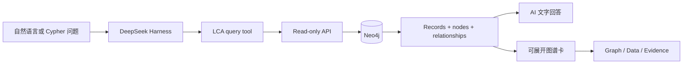

# 图谱结果界面设计

## 要解决的问题

文字适合解释结论，却不适合同时表达几十个资产、格式、schema、软件、机构、版本和证据之间的连接。这个界面把每次查询得到的关系子图放在回答内部：研究人员先读 AI 的文字结论，再按需展开图谱核查结构和来源。

它不是第二套知识图谱，也不是 Neo4j Browser 的复制品。Neo4j 仍是唯一图数据库；图谱卡只是同一次查询结果的交互式表达。

## 使用流程

文字与图形共享同一份结果，避免 AI 回答和可视化各自重新查询、出现口径漂移。API token 和 Neo4j 凭据只留在服务端；浏览器不会获得数据库连接信息。

## 界面组成

- **Graph**：显示有方向的节点和关系；支持 Connected、Hierarchy、Circle 和 Grid 四种布局。
- **Data**：把本次查询的记录放在可滚动表格中，便于复制和逐项核对。
- **Evidence**：单独列出公开来源、证据摘录、可靠性和访问条件，并提供原始链接。
- **Inspector**：点选节点或关系后显示稳定 UID、类型、属性、两端对象和来源字段。
- **Export**：PNG、SVG 适合报告和演示；JSON 保留完整子图；Cypher 保留本次查询及参数说明。

节点用类型区分颜色和形状，关系带箭头。界面继承 DSH 的明暗主题、字体、间距和交互状态，不建立另一套视觉语言。

## 与查询插件的关系

代码仍放在一个 Git 项目中，但内部按职责分成两个包：

| 内部组件 | 作用 |
|---|---|
| `@global-lca/dsh-lca-plugin` | 自然语言工具、领域规则、API 调用和安全边界 |
| `@global-lca/dsh-lca-graph-ui` | 浏览器中的关系图、数据表、证据和导出；作为内部开发模块 |

构建时，查询 bundle 把图谱模块编译成自己的 browser client。DSH 配置只需注册查询 bundle，使用者也只安装一个 `.tgz`。拆成两个内部源码包只是为了避免服务端查询逻辑和浏览器图形代码互相污染，并不会形成两个产品或两次安装。

## 可追溯和重放

五个能返回子图的工具会把标准化展示元数据随工具结果保存：`lca_get_asset`、`lca_find_relationships`、`lca_find_path`、`lca_query_graph` 和可选的 `lca_run_readonly_cypher`。重新打开会话时，图谱卡直接重放保存的结果，不依赖再次调用 API。旧结果若没有展示元数据，界面会尝试从原始 JSON 文本恢复。

## 范围控制

图谱卡服务于“理解本次问题”，不是一次性浏览全部图谱。单张卡最多显示 500 个节点和 1,500 条关系，超过上限时明确显示 `limited view`。需要扩大范围时，研究人员继续提出邻域、路径或筛选问题，让服务端形成新的、证据边界清楚的子图。

这样比在浏览器直接运行任意 Cypher更适合公开使用：普通用户只通过受控工具查询，专家 Cypher仍由服务端进行只读校验、`EXPLAIN` 和规模限制。
